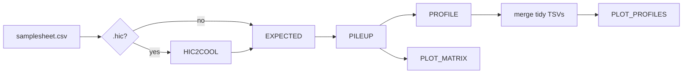

# hicpup-nf

[](https://github.com/DanielGarbozo/hicpup-nf/actions/workflows/ci.yml)
[](https://www.nextflow.io/)
[](LICENSE)

Nextflow (DSL2) pipeline for **downstream** Hi-C fountain analysis: converts Juicer
`.hic` to cooler and runs expected → pileup → 60° cone profiles. It wraps the
[`hicpup`](https://github.com/DanielGarbozo/hicpup) package - all the science lives
there; this repo chains and containerises it.

## Where this sits

```
FASTQ ──[ nf-core/hic ]──▶ .hic / .cool ──[ hicpup-nf ]──▶ cone profiles + figures
        (upstream, cited,                 (this repo:
         not run here)                     HIC2COOL? → EXPECTED → PILEUP → PROFILE → PLOT)
```

**hicpup-nf does not process FASTQ.** Reprocessing reads to regenerate coolers that
already exist would burn compute and demonstrate nothing. Read alignment and matrix
construction are [nf-core/hic](https://github.com/nf-core/hic)'s job (Servant et al.,
built on HiC-Pro, cooler output) - this is the layer that comes after.

## Quickstart

```bash
nextflow run DanielGarbozo/hicpup-nf -profile test,docker --outdir results
```

Runs offline on a synthetic fixture in a few minutes and writes
`results/figures/cone_profiles.pdf`. This is what CI runs on every push.

## Workflow



`EXPECTED`, `PILEUP`, `PROFILE` and `PLOT_MATRIX` run once per sample, in parallel.
`PLOT_PROFILES` is the fan-in: because `hicpup profile` emits tidy long format with
`strain`/`replicate`/`view` in every row, merging the per-sample tables is a
header-preserving concatenation, and adding a sample changes no pipeline code.

## Input

```csv
strain,replicate,matrix
ca1200,combined,/path/to/ca1200.cool
ss01a,combined,https://example.org/ss01a.hic
```

`matrix` may be a local path, a path relative to the pipeline directory, or an
`http(s)`/`ftp` URL - Nextflow stages remote inputs itself, so there is no separate
download process. Entries ending in `.hic` go through `HIC2COOL` first; `.cool`
entries skip it.

Plus two reference assets: `--chromsizes` (bed3; `hicpup.views` requires exactly
6 rows, 5 autosomes + chrX) and `--fountains_x` / `--fountains_a` (BED4:
`chrom, start, end, strength`).

**Which views get analysed is derived, not configured.** hicpup maps view → feature
key by convention (`X → fountains_x`, `A → fountains_a`) and skips a view whose BED
is absent. The pipeline reads the same signal: provide only `--fountains_x` and it
analyses view X only, and the figure has one panel. This avoids the failure mode
where asking for a view with no data yields a silently empty panel.

## Profiles

| Profile | What it does |
|---|---|
| `test` | Synthetic hicpup fixture, offline, 2 samples. What CI runs. |
| `full` | GSE188849 CA1200 vs SS01A from GEO, including the `.hic → .cool` step. |
| `docker` | Docker engine. |
| `singularity` | Singularity/Apptainer - the realistic mode on a shared HPC. |

Combine an execution engine with a data profile: `-profile test,docker`,
`-profile full,singularity`.

### Running on HPC

```bash
nextflow run DanielGarbozo/hicpup-nf -profile full,singularity \
    --input samplesheet.csv \
    --chromsizes ce10.chrom.sizes \
    --fountains_x fountains_X.bed \
    --outdir results
```

Add a scheduler executor (`process.executor = 'slurm'`) in your own config; per-process
resources are labelled `process_low` / `process_medium` / `process_high` in
`conf/base.config`. Both `cooltools.expected_cis` and `coolpup.pileup` take an explicit
`nproc`, wired to `task.cpus`, so changing a label really does change the tool's
parallelism.

### `-profile full`: real public data

[GSE188849](https://www.ncbi.nlm.nih.gov/geo/query/acc.cgi?acc=GSE188849) (Hi-C
SubSeries, Ercan lab), *C. elegans* L2–L3, auxin 1 hr:

| strain | role | file |
|---|---|---|
| `ca1200` | control | `GSE188849_CA1200_auxin1hr_L2-L3_JK07_JK08_30.hic` (~1.3 Gb) |
| `ss01a` | treatment | `GSE188849_SS01A_auxin1hr_L2-L3_JK09_JK10_30.hic` (~1.1 Gb) |

Not run in CI - the download would blow the runner. The CA1200 `.hic` is the public
form of the same control used in the hicpup tutorial, so the pipeline reproduces a
known result from the archived file rather than analysing unrelated data.

`HIC2COOL` produces a **single-resolution `.cool`**, not a multi-resolution `.mcool`:
`hicpup.io.load_coolers` does a plain `Path.exists()` on the configured path, so the
`file.mcool::/resolutions/1000` URI form is rejected before cooler ever sees it.

Format interconversion like this is routine in a core facility fed heterogeneous
deposits - GEO publishes Juicer `.hic`, the cooltools ecosystem consumes `.cool`.

## Parameters worth knowing

| Parameter | Default | Note |
|---|---|---|
| `--resolution` | `1000` | Validated against the cooler's `binsize`. |
| `--flank` | `100000` | Pileup flank in bp → `(2*flank/resolution + 1)` square matrix. |
| `--cone_angle` | `60` | |
| `--ndiags` | `40` | Antidiagonals stacked per side. |

Two of these have sharp edges, both discovered by running the chain on the test fixture:

- **`--flank` must fit the chromosome.** If the window runs off the end, coolpuppy
  piles up *zero* windows and returns an all-NaN matrix **without failing**. The run
  goes green and the figure comes out empty. CI asserts the merged profile contains no
  NaN precisely to catch this.
- **`--ndiags` is bounded by the pileup matrix.** Too large and
  `hicpup.cone.cone_diagonals` raises an opaque `IndexError`. For the 41×41 matrix the
  test profile produces, the limit is 17.

`conf/test.config` therefore uses `flank=20000, ndiags=15`, not the defaults.

## How the hicpup CLI is wrapped

`hicpup`'s CLI is config-driven: `expected` and `pileup` take a `--config` YAML
declaring every cooler and loop over all `(strain, replicate) × view` combinations
internally. This pipeline fans out one task per sample instead, so
[`bin/write_hicpup_config.py`](bin/write_hicpup_config.py) emits a YAML declaring
exactly one cooler per task. Nextflow stages inputs flat into the task directory, so
`data_root: "."` plus bare filenames is all the resolution hicpup needs.

| Process | Command |
|---|---|
| `HIC2COOL` | `hic2cool convert in.hic out.cool -r 1000` |
| `EXPECTED` | `hicpup expected --config c.yaml --output expected.parquet` |
| `PILEUP` | `hicpup pileup --config c.yaml --expected expected.parquet --output pileup.pkl` |
| `PROFILE` | `hicpup profile --pileup pileup.pkl --output profile.tsv --cone-angle 60` |
| `PLOT_PROFILES` | `hicpup plot --kind profiles-by-view --profile merged.tsv --output cone_profiles.pdf` |
| `PLOT_MATRIX` | `hicpup plot --kind matrix --pileup pileup.pkl --output matrix.pdf` |

`hicpup plot --kind window-grid` is not wired up: it needs a per-window pileup
(`hicpup pileup --by-window --no-local`), a different invocation from the averaged
pileup the rest of the chain uses.

## Output

```
results/
├── cooler/            .cool converted from .hic          (full only)
├── expected/          <sample>.expected.parquet
├── pileup/            <sample>.pileup.pkl
├── profile/           <sample>.profile.tsv, profiles_merged.tsv
├── figures/           cone_profiles.pdf, <sample>.<view>.matrix.pdf
└── pipeline_info/     execution report, timeline, trace, DAG, software versions
```

## Scope

Module A (fountain cone profiles) only. hicpup's Modules B (P(s) slopes) and C (rex
sites) land here as subworkflows once they exist upstream; the channel layout takes
them without a refactor.

## Credits

Pipeline by Daniel Garbozo. It orchestrates:

- [hicpup](https://github.com/DanielGarbozo/hicpup) - the analysis package
- [cooler](https://github.com/open2c/cooler), [cooltools](https://github.com/open2c/cooltools),
  [coolpuppy](https://github.com/open2c/coolpuppy), [bioframe](https://github.com/open2c/bioframe) - Open2C
- [hic2cool](https://github.com/4dn-dcic/hic2cool) - 4DN DCIC
- [nf-core/hic](https://github.com/nf-core/hic) - the upstream pipeline this one follows

Data: Morao, Kim, … Ercan, GEO [GSE188849](https://www.ncbi.nlm.nih.gov/geo/query/acc.cgi?acc=GSE188849).

## License

MIT - see [LICENSE](LICENSE).
